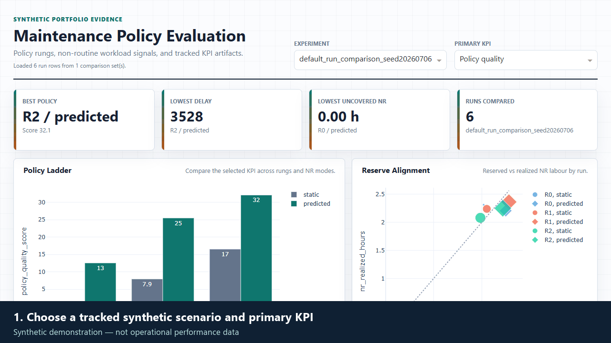

# Aircraft Maintenance ML Simulator

Public, synthetic-data version of an aircraft maintenance simulation project. The repository provides reproducible simulation fixtures, policy evaluation tooling, and service interfaces without publishing any private airline data.

[](https://github.com/lhnsdbc/Airline-Maintenance-Simulator-Public/actions/workflows/ci.yml)
[](https://github.com/lhnsdbc/Airline-Maintenance-Simulator-Public/actions/workflows/quality.yml)
[](https://github.com/lhnsdbc/Airline-Maintenance-Simulator-Public/actions/workflows/verify-live-demo.yml)

## 60-Second Recruiter Walkthrough



The walkthrough follows one decision path: select a synthetic scenario, compare policy rungs, inspect the KPI and reserve trade-off, then read the evidence-bounded analyst report. All values shown are synthetic.

- [Read the evaluation card](docs/EVALUATION.md) for fixed-seed distributions, KPI definitions, and limitations.
- [Read the one-page case study](docs/CASE_STUDY.md) for the stakeholder decision narrative.

## What This Project Shows

- Discrete-event simulation for aircraft operations and maintenance planning.
- Baseline and learned maintenance-policy comparison hooks.
- Synthetic input generation for reproducible local runs.
- Experiment runner structure for fixed scenarios, seeds, and policy rungs.
- Experiment tracking, dashboarding, API packaging, CI, deployment configuration, grounded LLM reporting, retrieval/RAG, GenAI orchestration, and monitoring around synthetic maintenance scenarios.

## Live Demo

- Dashboard: https://maintenance-simulator-dashboard.onrender.com
- API: https://maintenance-simulator-api.onrender.com
- API docs: https://maintenance-simulator-api.onrender.com/docs
- RAG example: https://maintenance-simulator-api.onrender.com/rag/search?q=predicted%20uncovered&nr_mode=predicted

The demo runs on Render free services, so the first request after inactivity may take a short time to wake up.

The **Live demo smoke check** badge above is the last scheduled or manual verification result. It retries cold starts and checks the API/dashboard health plus a deployed KPI-response contract; it is a maintenance signal, not a production uptime guarantee. See [the deployment runbook](docs/DEPLOYMENT.md#scheduled-demo-verification).

## Engineering Evidence

The front-page badges link to these checks:

- **Public CI:** synthetic-fixture generation, tracked experiment, smoke workflow, unit tests, container builds, and sensitive-term scan.
- **Quality checks:** measured unit-test coverage (saved as a CI artifact), Ruff syntax/undefined-name linting, MyPy type-checking of the deployed-demo verifier, and `pip-audit` over service dependencies.
- **Live demo smoke check:** weekday external verification of the Render API and dashboard, including the deployed `/experiments/{id}/kpis` response contract.

Run the same checks locally with:

```powershell
pip install -r requirements-dev.txt
py -m coverage run -m unittest discover -s tests -v
py -m ruff check api analyst dashboard experiments scripts tests --select E9,F63,F7,F82
py -m mypy scripts/verify_live_demo.py
py -m pip_audit -r requirements-service.txt
```

## Project Map

- `generate_dummy_data.py` and `generate_mock_nr_artifact.py`: synthetic fixture generation.
- `experiments/`: tracked deterministic policy-comparison workflow.
- `dashboard/`: Dash policy-comparison dashboard.
- `api/`: FastAPI service for health, profiles, policy comparisons, experiment lookup, search/RAG, LLM reports, and metrics.
- `analyst/`: grounded stakeholder report generation from KPI artifacts.
- `orchestration/`: optional LangChain orchestration over retrieval, grounded reports, and prompt packaging.
- `retrieval/`: lexical and vector retrieval over KPI/profile/report artifacts.
- `docs/`: architecture, data notice, roadmap, project positioning, and publication checklist.

## Data Policy

This repository is designed to contain synthetic fixtures only. It intentionally excludes private airline extracts, derived real-input bundles, generated output folders, pickles, trained model weights, and historical Git history from the private working project.

Generate local synthetic inputs with:

```powershell
py generate_dummy_data.py
py generate_mock_nr_artifact.py
```

The generated files are ignored by Git.

## Quick Start

```powershell
py -m venv .venv
.\.venv\Scripts\Activate.ps1
pip install -r requirements.txt
py generate_dummy_data.py
py generate_mock_nr_artifact.py
py main.py
```

The synthetic generator creates a medium-size one-week scenario with synthetic aircraft, airports, rotations, maintenance slots, maintenance-policy rows, and NR prediction artifacts. Some optimization paths require a solver supported by Pyomo. If a commercial solver is unavailable, use the synthetic smoke workflow first and keep solver-dependent experiments scoped accordingly.

The default generated profile is intentionally large enough to exercise realistic code paths:

- 31 synthetic aircraft registrations.
- 38 synthetic airports.
- 127 rotations and 311 flight legs in a one-week schedule.
- 10 maintenance-slot templates.
- 403 synthetic maintenance-policy rows.
- 404 conditional NR prediction rows including the fleet fallback.

## Experiment Tracking Demo

Run a deterministic policy-comparison experiment over the generated synthetic profile:

```powershell
py -m experiments.synthetic_experiment --scenario default_run --seed 20260706
```

This writes one reproducible local record per policy rung and NR mode under `artifacts/experiments/`, plus a comparison table and short Markdown summary. Each run record includes scenario ID, seed, simulator revision, policy rung, NR mode, metadata, and KPI proxies.

If `mlflow` is installed, the same run params, metrics, and JSON artifacts are also mirrored to a local MLflow experiment named `synthetic-policy-comparison`. MLflow is optional so the synthetic public workflow remains easy to run:

```powershell
pip install -r requirements-mlops.txt
py -m experiments.synthetic_experiment --scenario default_run --seed 20260706
mlflow ui --backend-store-uri ./mlruns
```

Each comparison artifact also includes `mlflow_manifest.json`, which lists the tracked params, metrics, artifact paths, and whether MLflow logging happened in the current environment.

## Dashboard

After creating experiment artifacts, open the policy-comparison dashboard:

```powershell
py -m dashboard.app --port 8050
```

Then visit `http://127.0.0.1:8050`. The dashboard reads `artifacts/experiments/*/kpis.csv`, compares policy rungs and NR modes, highlights delay, uncovered NR labour, interval spillage, and overall proxy quality, and shows the grounded analyst report plus LLM prompt package for the selected experiment.

## API Service

Run the FastAPI service after installing dependencies and generating synthetic fixtures:

```powershell
py -m api.app
```

Key endpoints:

- `GET /health`
- `GET /metrics`
- `GET /profile/default_run`
- `POST /compare-policies`
- `GET /experiments`
- `GET /experiments/{comparison_id}/profile`
- `GET /experiments/{comparison_id}/kpis`
- `GET /search?q=predicted%20uncovered&nr_mode=predicted`
- `GET /rag/search?q=predicted%20uncovered&nr_mode=predicted`
- `POST /experiments/{comparison_id}/llm-report`

The API validates request inputs with Pydantic and returns experiment IDs, reproducibility metadata, and KPI records from the synthetic tracking artifacts.

## Docker And CI

The public service has a lightweight dependency set in `requirements-service.txt` for the synthetic API/dashboard workflow. Build and run the API container with:

```powershell
docker build -t aircraft-maintenance-ml-simulator .
docker run --rm -p 8000:8000 aircraft-maintenance-ml-simulator
```

The image generates synthetic fixtures and a deterministic comparison artifact during build, then serves the API on port `8000`.

For a public demo, `render.yaml` defines separate Render web services for the API and dashboard. The dashboard uses `Dockerfile.dashboard` and serves port `8050`.

See [docs/DEPLOYMENT.md](docs/DEPLOYMENT.md) for the Render runbook, post-deploy checks, optional provider-key setup, and honest CV wording before/after public deployment.

GitHub Actions CI is configured to install the public workflow dependencies, generate synthetic fixtures, run the tracked experiment, run the public workflow smoke script, execute tests, build both Docker images, and scan for private-source terms.

## Grounded Analyst Report

Generate a stakeholder-readable report from tracked KPI artifacts:

```powershell
py -m analyst.experiment_report default_run_comparison_seed20260706
```

The report cites exact run IDs and metric values from `kpis.csv`, then writes a Markdown report under `reports/`. This is the grounded reporting layer that can later be connected to an LLM summarizer without letting the model invent evidence.

Build an LLM-ready prompt package from the same grounded evidence:

```powershell
py -m analyst.llm_prompt default_run_comparison_seed20260706
```

This writes a provider-neutral JSON prompt package under `reports/llm_prompts/`. It contains strict grounding instructions, the KPI records, scenario profile, and the deterministic analyst report. It does not call an external API or require a model key.

Generate an optional live provider-backed report from the same evidence package:

```powershell
$env:GEMINI_API_KEY = "..."
py -m analyst.live_llm default_run_comparison_seed20260706 --provider gemini
```

Gemini is the recommended low-cost/free-tier option for live generation. You can also use `--provider openai` with `OPENAI_API_KEY` or `--provider anthropic` with `ANTHROPIC_API_KEY`. Without a provider key, the command writes the deterministic grounded report as a fallback, so local tests and CI do not depend on paid services.

## GenAI Orchestration

The optional LangChain path coordinates retrieval, grounded report generation, and prompt packaging into an auditable orchestration trace:

```powershell
pip install -r requirements-genai.txt
py -m orchestration.langchain_analyst default_run_comparison_seed20260706 --question "Which policy reduces uncovered NR workload?"
```

This writes a LangChain trace under `reports/orchestration/` and a grounded prompt package under `reports/llm_prompts/`. It does not require a live model key; the provider-backed generation remains in `analyst.live_llm`.

## Retrieval And Monitoring

The API includes dependency-free lexical retrieval over generated KPI/profile/report artifacts:

```powershell
Invoke-WebRequest "http://127.0.0.1:8000/search?q=predicted%20uncovered&nr_mode=predicted"
```

It also includes a vector retrieval path for RAG over simulation evidence:

```powershell
py -m retrieval.vector build --backend local
py -m retrieval.vector search "predicted uncovered"
Invoke-WebRequest "http://127.0.0.1:8000/rag/search?q=predicted%20uncovered&nr_mode=predicted"
```

For a Chroma-backed vector store, install the optional RAG dependencies and rebuild the index:

```powershell
pip install -r requirements-rag.txt
py -m retrieval.vector build --backend chroma
py -m retrieval.vector search "predicted uncovered" --backend chroma
```

The deployed API uses the dependency-free local vector backend by default. The Chroma backend is optional and intended for local RAG portfolio work or a larger deployment image. On Windows, Chroma's native add path can be unstable; use a Linux/container environment for the cleanest Chroma verification.

It also exposes lightweight runtime monitoring at `/metrics`, including request count, failure count, generated comparison count, search count, average latency, and available artifact count.

Run the key-free smoke path used by CI:

```powershell
py scripts/smoke_public_workflow.py
```

## Roadmap

1. Extend the local/optional-MLflow experiment tracker to full simulator runs.
2. Extend the Dash policy-comparison dashboard with scenario filters and historical run comparisons.
3. Extend the FastAPI service from synthetic policy comparison to full simulator workflows.
4. Extend Docker/CI from synthetic service smoke tests to full simulator smoke tests.
5. Extend the optional live LLM adapter with streaming and provider-specific structured-output validation.
6. Extend vector retrieval evaluation with labeled evidence queries and recall checks.
7. Extend monitoring from in-process API metrics to Prometheus-compatible export.

## Project Scope

This repository is a public, synthetic-data implementation of an aircraft maintenance simulation and policy-evaluation workflow. It is suitable for studying software architecture, experiment tracking, service packaging, and stakeholder reporting patterns without exposing private operational data.

See [docs/ARCHITECTURE.md](docs/ARCHITECTURE.md), [docs/DEPLOYMENT.md](docs/DEPLOYMENT.md), and [docs/PROJECT_POSITIONING.md](docs/PROJECT_POSITIONING.md) for scope, architecture notes, deployment steps, and usage boundaries. Before publishing or mirroring the project, run [docs/PUBLICATION_CHECKLIST.md](docs/PUBLICATION_CHECKLIST.md).

Avoid presenting synthetic KPI values as real operational results.
