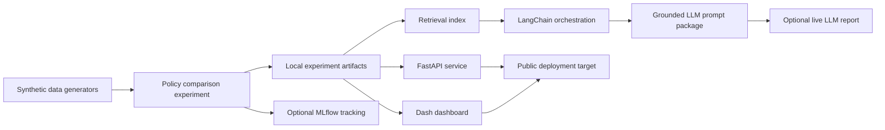

# Architecture

This repository is organized as a public, synthetic-data workflow for maintenance policy evaluation. The design keeps private operational data out of the project while still showing the shape of an end-to-end analytics and ML engineering system.

## System Flow

## Components

- `generate_dummy_data.py` and `generate_mock_nr_artifact.py` create public synthetic fixtures.
- `experiments/synthetic_experiment.py` runs deterministic policy comparisons across policy rungs and non-routine workload modes.
- `experiments/tracking.py` writes local artifacts and can mirror parameters, metrics, and files to MLflow when MLflow is installed.
- `dashboard/app.py` visualizes KPI comparisons, grounded analyst text, and the LLM prompt package for the selected experiment.
- `api/app.py` exposes health, metrics, experiment lookup, search, and policy-comparison endpoints.
- `retrieval/search.py` provides dependency-free lexical retrieval over KPI, profile, and report artifacts.
- `analyst/experiment_report.py`, `analyst/llm_prompt.py`, and `analyst/live_llm.py` create deterministic reports, evidence-bounded prompts, and optional provider-backed summaries.
- `orchestration/langchain_analyst.py` provides an optional LangChain chain that coordinates artifact loading, retrieval, grounded report generation, and prompt packaging.

## Evidence Boundary

All public outputs are derived from synthetic fixtures and generated experiment artifacts. LLM features are constrained to the evidence bundle produced by the project. The intended claim is not operational airline performance; it is the engineering workflow around simulation, experiment tracking, retrieval, dashboarding, and grounded reporting.
